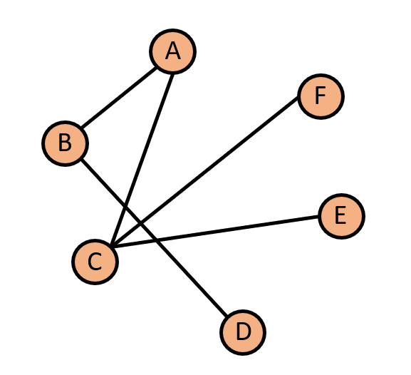

# BFS and DFS Algorithms Implementation in C++

## Overview

This repository includes the implementation of the Breadth-First Search (BFS) and Depth-First Search (DFS) algorithms in C++. 

## Implemented Algorithms

### Breadth-First Search (BFS)

BFS is an algorithm for traversing or searching tree or graph data structures. It starts at the root node and explores the neighbor nodes first before moving to the next level. BFS is often used for tasks such as finding the shortest path in unweighted graphs and network analysis.

### Depth-First Search (DFS)

DFS is another graph traversal algorithm that explores as far as possible along each branch before backtracking. It's commonly used for topological sorting, cycle detection, and solving puzzles like mazes. DFS has applications in various domains, including artificial intelligence and data mining.

# Example

In this graph:

## Breadth-First Search (BFS) Traversal

BFS explores nodes level by level, starting from the source node. It visits all neighbors of the source before moving to their neighbors.

### BFS Starting from Node A

1. Start at node A.
2. Visit node A.
3. Enqueue neighbors B and C: `B, C`.
4. Dequeue node B. Visit node B.
5. Enqueue neighbor D: `C, D`.
6. Dequeue node C. Visit node C.
7. Enqueue neighbors E and F: `D, E, F`.
8. Dequeue node D. Visit node D.
9. Dequeue node E. Visit node E.
10. Dequeue node F. Visit node F.

BFS traversal order: A, B, C, D, E, F

## Depth-First Search (DFS) Traversal

DFS explores as deeply as possible along each branch before backtracking.

### DFS Starting from Node A

1. Start at node A.
2. Visit node A.
3. Recursively explore node A's unvisited neighbors, starting with B:
   - Visit node B.
   - Recursively explore node B's unvisited neighbors, starting with D:
     - Visit node D.
   - Backtrack to node B.
4. Recursively explore node A's unvisited neighbors, starting with C:
   - Visit node C.
   - Recursively explore node C's unvisited neighbors, starting with E:
     - Visit node E.
   - Recursively explore node E's unvisited neighbors, starting with F:
     - Visit node F.
   - Backtrack to node C.
5. Backtrack to node A.

DFS traversal order: A, B, D, C, E, F

In this example, you can see the difference in traversal order between BFS and DFS. BFS explores all nodes at a given level before moving deeper, while DFS explores as deeply as possible along each branch before backtracking.
